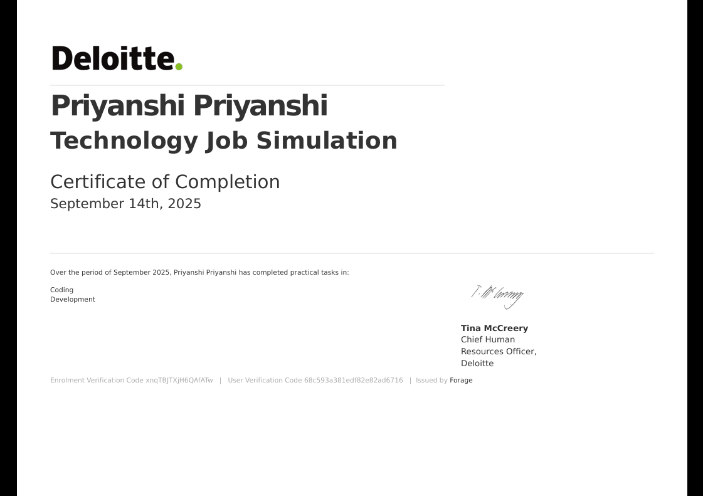

## Deloitte Australia - Job Simulation

This repository captures my learning journey through a job simulation by Deloitte Australia. It focuses on documenting how I approached the tasks, what I learned, and how the work maps to real-world project practices. A certificate of completion is attached to document successful completion.

 

 
### Learning Objectives

- Understand how to interpret ambiguous requirements and convert them into actionable steps.
- Practice data normalization and format transformation with attention to time formats.
- Develop clear, concise technical documentation and formal proposal writing.
- Strengthen habits for testing, validation, and iterative improvement.

### Skills and Tools Practiced

- Data parsing and timestamp normalization (ISO ↔ milliseconds)
- Requirements analysis and scoping
- Proposal writing and stakeholder communication
- Version control hygiene and documentation-first workflow

### Repository Structure

- `Task1/Task1_Description.md` — Instructions for telemetry normalization and format unification (if present).
- `Task2/Task2_Description.md` — Instructions to write a concise, formal development proposal.
- `README.md` — You are here. Project overview, setup, and usage.

### Tasks

#### Task 1: Telemetry Normalization
- Create an account on repl.it and fork the project.
- Explore two input data formats representing the same message: `data-1.json` and `data-2.json`.
- Review the target unified format in `data-result.json`.
- Complete the solution in `main.py`; two functions are marked with "IMPLEMENT:" comments.
- Convert timestamps so both inputs match the target format (milliseconds). One source may use ISO time; convert accordingly.
- Use the built-in tests by running the project in repl.it; aim for zero test failures.
- Add brief comments in `main.py` if clarifications are needed.

#### Task 2: Development Proposal
- Write a short, formal, and informative proposal for a private dashboard that displays health statuses of 9 machines across each of Daikibo's 4 factories.
- Access restricted to the client intranet; authentication via internal server (company accounts).
- Single-page dashboard view with collapsible/expandable sections at factory and device levels, including history of statuses.
- The proposal must include: Overview, Scope, Visual References (from the template), Estimate (man-hours with breakdown), Timeline (milestones), and Support (ongoing reliability and enhancements).
- Use a word-processing tool (MS Office or LibreOffice). Follow the template referenced in the Resources.

### What I Learned: Task 1 (Telemetry)

- Converted between ISO timestamps and millisecond epochs to match a target schema.
- Built confidence reading unfamiliar code and completing targeted implementations.
- Used tests as a feedback loop to validate transformation logic and edge cases.

### What I Learned: Task 2 (Proposal)

- Structured a concise, formal proposal that balances clarity and completeness.
- Practiced scoping, estimation (man-hours), and milestone planning.
- Communicated support and maintenance commitments clearly for stakeholders.

### Challenges and How I Resolved Them

- Timestamp mismatches between formats: standardized on milliseconds and added conversion logic verified by tests.
- Balancing brevity with completeness in the proposal: used headings, bullets, and a template-aligned outline.
